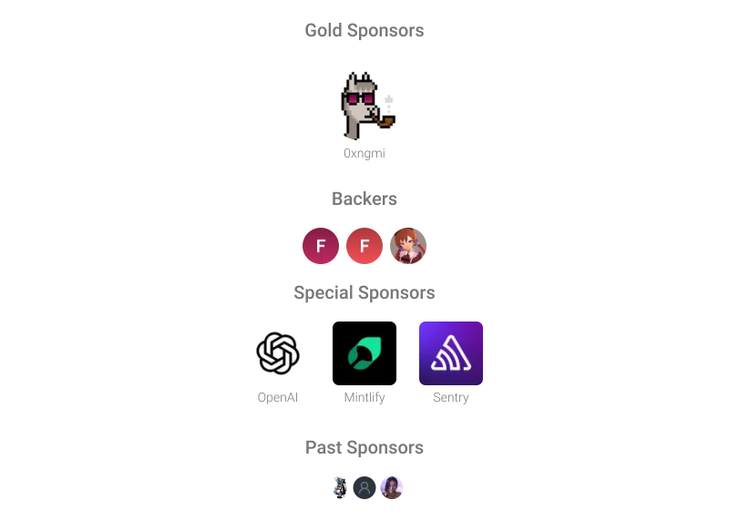

<h1 align="center">Koharu</h1>

<p align="center">ML-powered manga translator, written in <b>Rust</b>.</p>

> [!WARNING]
> **本仓库是个人自用的二次开发分支，不是 Koharu 官方仓库。**
>
> 基线是官方 [koharu-rs/koharu](https://github.com/koharu-rs/koharu) 的 `0.83.5`，此后持续合并上游更新。动手的理由是官方版本不满足我自己的翻译工作流，而不是觉得它做得不够好——所以这份分支的目标是「够用」，不是「更好」，不追求与官方版本对齐，也没有发布预编译安装包。
>
> **在官方能力之上，本分支增加了：**
>
> - **条漫（webtoon）支持**
>   官方只处理页漫。条漫是一张超高纵向长图，本分支在导入时按可读高度切页并保持宽高比，切片统一以 JPEG q92 编码并并行处理；条漫首尾的站点广告带在导入时裁掉，高度按每部漫画单独配置。检测侧另有针对条漫的改进：跨气泡的文本块按行投影拆成各自的 utterance、掩膜感知的重复抑制、粘连的气泡拆成各自轮廓。
> - **上文注入**
>   翻译每一页时注入该部漫画的术语表与翻译风格指导，而不是把两者塞进一段散文。上文回溯窗口在章内滑动并跨章边界连续：翻到本章第 1 页时窗口整段来自上一章末尾，翻到第 2 页时让出一页换成本章第 1 页。术语表命中放宽到词元，因此认得出人名的简称。
> - **漫画系列管理**
>   官方以「项目」为管理单位。本分支把项目按漫画归拢成书架，每部漫画拥有自己的设置（条漫广告带、翻译风格指导、上文页数、术语表）。章节列表支持搜索、全选、按编号区间批量处理、批量导出 cbz 与批量删除；漫画库位置可在设置里指定；可绑定 OmegaScans 地址一键拉取缺失章节；编辑器内加入章间跳转。
> - **其他**
>   漫画管理页改为左右分栏（章节列表 / 设置与操作）。CEF 内核与 Tauri v3 alpha 跟随上游同步。
>
> 设计取舍与实测记录写在 [`docs/`](./docs)（中文）；条漫支持的技术细节与性能数据见 [`docs/reference/koharu-webtoon-support.md`](./docs/reference/koharu-webtoon-support.md)。
>
> 上游的版权声明与双许可证完整保留，见 [License](#license)。

<p align="center">
<a href="https://github.com/koharu-rs/koharu/releases/latest" target="_blank"></a>
</p>

<p align="center">
<a href="https://trendshift.io/repositories/20649" target="_blank"></a>
</p>

<p align="center">
<a href="https://koharu.rs/en/installation" target="_blank">Getting Started</a> · <a href="https://koharu.rs/" target="_blank">Docs</a> · <a href="https://github.com/koharu-rs/koharu/issues" target="_blank">Bug reports</a> · <a href="https://discord.gg/mHvHkxGnUY" target="_blank">Discord</a>
</p>

<p align="center">
<a href="https://koharu.rs/ja" target="_blank">日本語</a> | <a href="https://koharu.rs/zh" target="_blank">简体中文</a>
</p>

Koharu introduces a local-first workflow for manga translation, utilizing the power of ML to automate the process. It combines the capabilities of object detection, OCR, inpainting, and LLMs to create a seamless translation experience.

> [!NOTE]
> Koharu runs its vision models and LLMs **locally** on your machine to keep your data private and secure.

---


> [!NOTE]
> Join our [Discord server](https://discord.gg/mHvHkxGnUY) for support and discussion.

## Features

- [Multi-format project management](https://koharu.rs/en/guides/projects) for raster images, archives, and PDFs with page sequencing
- [Selective pipeline](https://koharu.rs/en/guides/processing) for detection, OCR, translation, and inpainting at page or project scope
- [Detection and segmentation](https://koharu.rs/en/guides/processing) for text regions, speech bubbles, and cleanup regions
- [Multimodal OCR](https://koharu.rs/en/models/vision) for dialogue, captions, and general page text
- [Local GGUF inference and hosted providers](https://koharu.rs/en/models/providers) for LLM and machine-translation workflows
- [Generative inpainting](https://koharu.rs/en/guides/cleanup) for source-text removal and artwork reconstruction
- [Proofreading](https://koharu.rs/en/guides/review) for correcting OCR and translation output
- [WebGPU-based canvas](https://koharu.rs/en/guides/canvas) for manual cleanup, text placement, and page composition
- [Multilingual text shaping and layout](https://koharu.rs/en/guides/typesetting) with automatic fitting, font fallback, vertical CJK, and right-to-left text
- [Layered PSD export](https://koharu.rs/en/guides/export) for flattened delivery and layered editing
- [Agent-based workflow](https://koharu.rs/en/agent/projects) for project inspection, editing, and pipeline control

## Hardware Acceleration

Koharu supports CUDA and ROCm / HIP on Windows and Linux, Metal on Apple silicon, and Vulkan on Windows and Linux. Keep your graphics driver current; a full CUDA or ROCm SDK installation is not required. See [Runtime and hardware requirements](https://koharu.rs/en/hardware) for model-specific guidance.

### CUDA

CUDA 13.3 requires an NVIDIA Turing-class or newer GPU and an R610 or newer driver. Check NVIDIA's official [CUDA toolkit, driver, and architecture matrix](https://docs.nvidia.com/datacenter/tesla/drivers/cuda-toolkit-driver-and-architecture-matrix.html) and install the [latest NVIDIA driver](https://www.nvidia.com/en-us/drivers/).

### ROCm / HIP

ROCm 10.0 support depends on the exact AMD GPU, operating system, and driver combination. Check AMD's official [ROCm 10.0.0 compatibility matrix](https://rocm.docs.amd.com/en/docs-10.0.0/compatibility/compatibility-matrix.html) and install a compatible [AMD driver](https://www.amd.com/en/support).

### Metal

Metal is available on Apple silicon Macs.

### Vulkan

Vulkan is available on Windows and Linux as an alternative to CUDA and ROCm / HIP.

### WebGPU

The editor canvas uses WebGPU and requires a current graphics driver even when inference runs on the CPU.

### CPU

CPU inference is available for supported workloads but is substantially slower.

## Machine Learning Models

Koharu uses separate models for detection, OCR, inpainting, and translation. [Vision and inpainting](https://koharu.rs/en/models/vision) and [translation and generation](https://koharu.rs/en/models/translation) have separate model settings.

### Computer Vision Models

Detection, OCR, and inpainting models are selected separately.

#### Detection and Layout

The detection model finds text regions, speech bubbles, and segmentation masks.

- [Koharu Layout RF-DETR Seg 2XL](https://huggingface.co/mayocream/koharu-layout-rfdetr-seg-2xl-1152)

#### OCR

OCR reads source text from detected regions.

- [PaddleOCR VL 1.6](https://huggingface.co/PaddlePaddle/PaddleOCR-VL-1.6)
- [Manga OCR](https://huggingface.co/mayocream/manga-ocr)
- [Baberu OCR](https://huggingface.co/genshiai-daichi/baberu-ocr)
- [Hayai OCR](https://huggingface.co/JustANormalTinkerer/hayai-ocr-v2)

#### Inpainting

Inpainting reconstructs the image behind source text before the translation is rendered.

- [FLUX.2 Klein](https://huggingface.co/unsloth/FLUX.2-klein-4B-GGUF)
- [RORem mixed](https://huggingface.co/mayocream/RORem-mixed-GGUF)
- [LaMa](https://huggingface.co/mayocream/lama-manga)
- [AOT GAN](https://huggingface.co/mayocream/aot-inpainting)

### Large Language Models

Translation can use a local language model or a remote API.

#### General-Purpose Local Models

- LFM 2.5: [lfm2.5-1.2b-instruct](https://huggingface.co/LiquidAI/LFM2.5-1.2B-Instruct-GGUF)
- Ministral 3: [ministral-3-8b-instruct](https://huggingface.co/mistralai/Ministral-3-8B-Instruct-2512-GGUF)
- Gemma 4: [gemma4-e2b-it](https://huggingface.co/unsloth/gemma-4-E2B-it-qat-GGUF), [gemma4-e4b-it](https://huggingface.co/unsloth/gemma-4-E4B-it-qat-GGUF), [gemma4-12b-it](https://huggingface.co/unsloth/gemma-4-12B-it-qat-GGUF), [gemma4-26b-a4b-it](https://huggingface.co/unsloth/gemma-4-26B-A4B-it-qat-GGUF), [gemma4-31b-it](https://huggingface.co/unsloth/gemma-4-31B-it-qat-GGUF)
- Qwen 3.5: [qwen3.5-0.8b](https://huggingface.co/unsloth/Qwen3.5-0.8B-GGUF), [qwen3.5-2b](https://huggingface.co/unsloth/Qwen3.5-2B-GGUF), [qwen3.5-4b](https://huggingface.co/unsloth/Qwen3.5-4B-GGUF), [qwen3.5-9b](https://huggingface.co/unsloth/Qwen3.5-9B-GGUF), [qwen3.5-27b](https://huggingface.co/unsloth/Qwen3.5-27B-GGUF), [qwen3.5-35b-a3b](https://huggingface.co/unsloth/Qwen3.5-35B-A3B-GGUF)
- Qwen 3.6: [qwen3.6-27b](https://huggingface.co/unsloth/Qwen3.6-27B-GGUF), [qwen3.6-35b-a3b](https://huggingface.co/unsloth/Qwen3.6-35B-A3B-GGUF)
- Qwen 3.8: [qwen3.8-27b](https://huggingface.co/unsloth/Qwen3.8-27B-GGUF)

#### Uncensored Local Models

- Gemma 4 uncensored: [gemma4-e2b-uncensored](https://huggingface.co/HauhauCS/Gemma-4-E2B-Uncensored-HauhauCS-Aggressive), [gemma4-e4b-uncensored](https://huggingface.co/HauhauCS/Gemma-4-E4B-Uncensored-HauhauCS-Aggressive), [gemma4-12b-uncensored](https://huggingface.co/HauhauCS/Gemma4-12B-QAT-Uncensored-HauhauCS-Balanced), [gemma4-26b-a4b-uncensored](https://huggingface.co/HauhauCS/Gemma4-26B-A4B-QAT-Uncensored-HauhauCS-Balanced-MTP), [gemma4-31b-uncensored](https://huggingface.co/HauhauCS/Gemma4-31B-QAT-Uncensored-HauhauCS-Balanced-MTP)
- Qwen 3.5 uncensored: [qwen3.5-2b-uncensored](https://huggingface.co/HauhauCS/Qwen3.5-2B-Uncensored-HauhauCS-Aggressive), [qwen3.5-4b-uncensored](https://huggingface.co/HauhauCS/Qwen3.5-4B-Uncensored-HauhauCS-Aggressive), [qwen3.5-9b-uncensored](https://huggingface.co/HauhauCS/Qwen3.5-9B-Uncensored-HauhauCS-Aggressive)
- Qwen 3.6 uncensored: [qwen3.6-27b-uncensored](https://huggingface.co/HauhauCS/Qwen3.6-27B-Uncensored-HauhauCS-Balanced), [qwen3.6-35b-a3b-uncensored](https://huggingface.co/HauhauCS/Qwen3.6-35B-A3B-Uncensored-HauhauCS-Aggressive)
- Qwen 3.8 uncensored: [qwen3.8-27b-uncensored](https://huggingface.co/HauhauCS/Qwen3.8-27B-Uncensored-HauhauCS-Aggressive-MTP-GGUF)

#### Cloud Providers

Hosted LLM providers: [OpenAI](https://platform.openai.com/), [Gemini](https://ai.google.dev/), [Claude](https://www.anthropic.com/api), [Grok](https://docs.x.ai/developers), [MiniMax](https://platform.minimax.io/), [DeepSeek](https://platform.deepseek.com/), and [OpenRouter](https://openrouter.ai/).

#### Machine Translation Providers

Machine-translation providers: [DeepL](https://www.deepl.com/), [Google Cloud Translation](https://cloud.google.com/translate), and [Caiyun](https://fanyi.caiyunapp.com/).

#### OpenAI-Compatible Providers

OpenAI-compatible endpoints are also supported.

## Installation

**本仓库不发布预编译安装包**，需要从源码构建，见 [Development](#development)。

官方安装包在 [koharu-rs/koharu releases](https://github.com/koharu-rs/koharu/releases/latest)，另有 winget 与 Homebrew 渠道（见下方）。但那些构建**不包含**上面列出的条漫、系列管理与上文注入能力。上游文档里的[安装要求与首次启动说明](https://koharu.rs/en/installation)对本分支同样适用。

### WinGet

Install on Windows with [winget](https://learn.microsoft.com/en-us/windows/package-manager/winget/):

```bash
winget install koharu
```

### Homebrew

Install on macOS with [Homebrew](https://brew.sh/):

```bash
brew install --cask koharu
```

> [!IMPORTANT]
> 以上两个渠道安装的是**官方版本**。本分支的内置更新也指向官方发布通道——官方一旦发布新版本就会提示更新，而升级后本分支的能力会全部消失。因此请勿使用应用内的更新功能；需要回到本分支的代码时重新构建即可。

## Troubleshooting

Startup, runtime, model, and provider errors are covered in [Troubleshooting](https://koharu.rs/en/reference/troubleshooting). Set `RUST_LOG` to `debug` or `trace` for verbose logs:

```bash
# macOS / Linux
RUST_LOG=debug koharu
# Windows (PowerShell)
$env:RUST_LOG="debug"; koharu.exe
```

## Development

Platform dependencies and validation commands for local builds are listed in [Development Setup](https://koharu.rs/en/development/setup).

### Prerequisites

- [Rust](https://www.rust-lang.org/tools/install) 1.97.1 or later (Rust 2024 edition)
- [Bun](https://bun.sh/) 1.3.14 or later
- [LLVM](https://llvm.org/) 22.1.8 or later

### Install dependencies

```bash
bun install
```

### Development

```bash
bun dev
```

### Build

```bash
bun run build
```

The executable is written to `target/release`. This produces the executable only — the
installer bundle belongs to the release workflow, which this branch does not run. A cold build
compiles CEF from source and therefore needs `cmake` and `ninja` on `PATH`.

## Sponsorship

If Koharu is useful in your workflow, consider sponsoring the project.

- [GitHub Sponsors](https://github.com/sponsors/mayocream)
- [Patreon](https://www.patreon.com/mayocream)



## Contributors ❤️

Thanks to all the contributors who have helped make Koharu better!

<a href="https://github.com/koharu-rs/koharu/graphs/contributors">
  
</a>

> 以上赞助与贡献者信息属于上游项目。报告问题时请先分清是本分支引入的还是上游已有的：上游问题去 [koharu-rs/koharu](https://github.com/koharu-rs/koharu)，本分支的问题记在本仓库。

## License

Copyright 2025-2026 Mayo Takanashi and Koharu contributors.

Koharu is dual-licensed under the [MIT License](LICENSE-MIT) or the
[Apache License, Version 2.0](LICENSE-APACHE), at your option.
